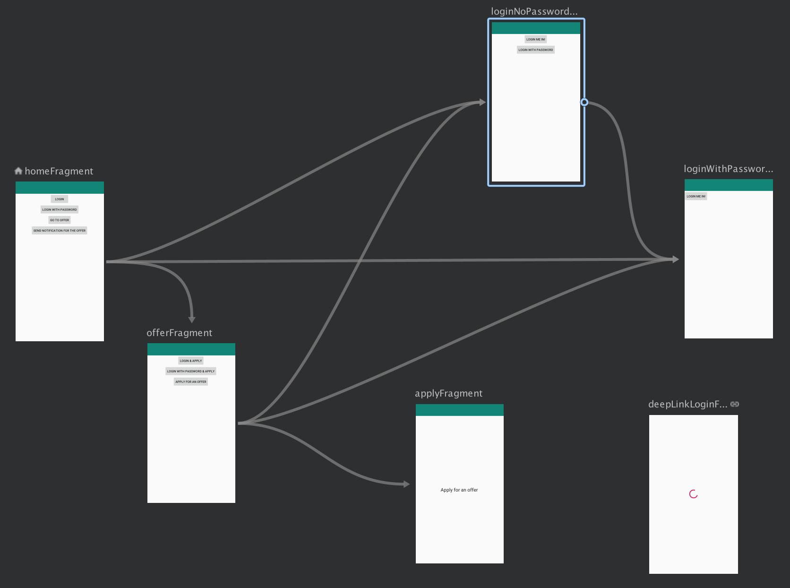
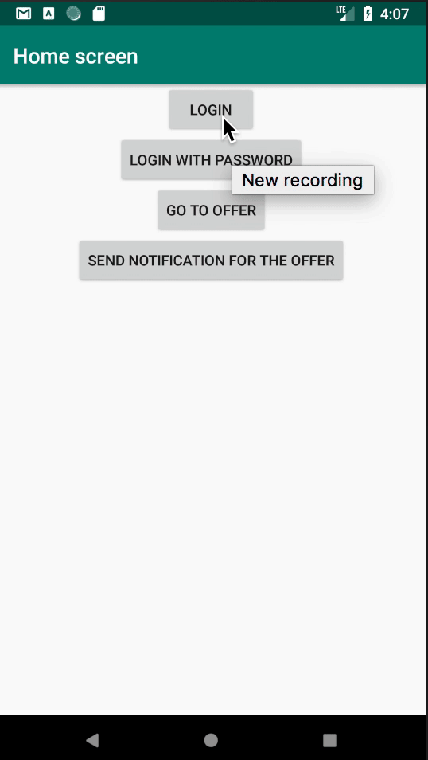

# Navigation Component Playground

This is a sample project where I experimented with different aspects of the [Android Navigation Component](https://developer.android.com/guide/navigation/navigation-getting-started).

## What's implemented?
- single Activity with Fragments
- navigation graph in XML
- handling of notifications (explicit deep links)
- custom handling of implicit deep links (more on that later)
- passing arguments between Fragments via [Safe Args](https://developer.android.com/guide/navigation/navigation-pass-data#Safe-args)
- starting Fragments for result and waiting for that result (similar to Activity's `startActivityForResult` and `onActivityResult`)
- transitions between fragments with shared Toolbar
- a simple Toolbar navigation icon morphing ("<-" -> "X")

There's no MVP/MVVM/MVI here, no dependency injection - just the Navigation Component to make it simple.

## How does it look like?

### App

### Graph

## What's custom in deep link handling?
Normally deep links would clear the entire back stack and start fresh. 
There are some differences between explicit and implicit deep links as well whether [Intent.FLAG_ACTIVITY_NEW_TASK](https://developer.android.com/reference/android/content/Intent#FLAG_ACTIVITY_NEW_TASK)
was provided or not.

In the sample app, regardless of `Intent.FLAG_ACTIVITY_NEW_TASK` I wanted to show the Fragment on top of the existing stack if the app was in the background or and start a new stack only if it was killed.

Also, this deep link when opened would pop specific Fragments from the back stack.

## Handling Fragments results
My approach is based on [Using Navigation Architecture Component in a large banking app](https://medium.com/google-developer-experts/using-navigation-architecture-component-in-a-large-banking-app-ac84936a42c2) article
with some tweaks added to be able to pop the back stack further than the previous screen e.g. 2 screens back.

In the sample app this happens when e.g. we have the following stack:

Offer Fragment --> Collective login Fragment -> Login with password Fragment

Now, what we would like to do is go back to Offer Fragment and in there handle this result and e.g. start Apply Fragment.
